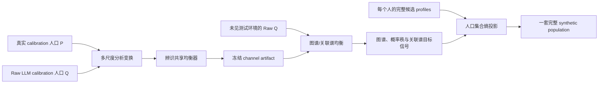

# SCOPE-Gen：基于系统辨识与人口集合投影的可迁移 LLM 社会生成器

> **版本：** v1.1（数学与实验审查修订版）。  
> **定位：** 从零开始的新方案；不继承 T/C/A、选择比率或逐题倾斜。  
> **暂定全名：** System-identified Calibration and Optimal Projection of Population Ensembles。  
> **一句话：** 把真实人口分布视为输入、LLM 人口分布视为受失真信道的输出，在互不重叠的校准环境上辨识共享的低阶均衡器，再把校正后的边际、关联和生命路径信号联合投影成一套完整人口。

---

## 0. 结论先行

最值得实现的不是更复杂的 prompt 分数，也不是更大的逐题 (P/Q) 表，而是下面这个四段式系统：

1. **分析（analysis）：** 把一套真实/LLM 人口变换成与 SSDataBench Type 1–5 对应的多尺度信号；
2. **辨识（identification）：** 只在 calibration environments 上估计少量、跨题共享的信道响应；
3. **均衡（equalization）：** 输入一套未见测试人口的 Raw (Q)，预测它对应的真实统计信号，不读取测试 (P)；
4. **合成（synthesis）：** 在每个人的多条完整 LLM 候选 profile 中做一次全局最小改动选择，生成同时满足五类校正信号的完整人口。

它最重要的改变是：

> 我们不再问“这道题应该怎样调”，而是问“LLM 信道通常怎样改变分布的低频、高频、关联强度和路径模态”。

主方法必须预测**未见环境**。同一题、同一年或同一数据分布上的反复抽样只能降低测量噪声，不能被算成新的辨识实验。

---

## 1. 研究对象

### 1.1 完整人口，而不是孤立答案

对环境 (e)（数据集、国家、年份和问题家族的组合），设：

- (X_i)：SSDataBench 允许输入给模型的背景；
- (Y_i)：一个人的全部静态回答与生命轨迹；
- (P_e(Y\mid X))：真实人口机制；
- (Q_e(Y\mid X))：固定模型、prompt、temperature 和解析协议诱导的 LLM 机制。

LLM 调用产生 (N) 个完整 synthetic twins 后，得到人口级输出 (Q_e)。研究目标不是恢复某个人的真实 (Y_i)，而是构造新人口 (R_e)，使：

\[
\mathcal A(R_e)
\approx
\mathcal A(P_e),
\]

其中 \(\mathcal A\) 是覆盖 SSDataBench 五类统计的分析变换。

### 1.2 信道模型

抽象地写：

\[
P_e
\xrightarrow{\ \mathcal C_{\text{LLM}}\ }
Q_e.
\]

这里的 \(\mathcal C_{\text{LLM}}\) 不是一句 prompt，也不是一个逐题常数，而是一个人口分布信道。它可能：

- 改变单变量分布形状；
- 放大或压缩变量间关联；
- 改变背景对结果的可预测性；
- 把生命路径压向少数规范顺序；
- 改变生命路径与背景的耦合强度。

SCOPE-Gen 辨识的是该信道在一组**可迁移坐标**中的低阶统计响应，而不是试图估计无限维的任意映射。由于 LLM 可能把某些真实状态压到零支持，\(\mathcal C_{\text{LLM}}\) 未必可逆；因此本文实现和主张的是 **transferable statistical inverse equalizer**，不是可识别的精确 \(\mathcal C_{\text{LLM}}^{-1}\)。

---

## 2. 为什么不直接学习 (Q\mapsto P)

如果给每道题一个自由矩阵，当然可以把校准题的 (Q) 精确映射到 (P)。但这只是记忆配对分布：

\[
T_q Q_q=P_q.
\]

对新题没有任何约束，也没有迁移含义。真正有研究价值的模型必须满足：

1. 参数数量不随题目数线性增长；
2. 不含测试 question ID 或测试真实统计；
3. 能作用于不同类别数、不同事件数和不同数据集；
4. 在未见题目家族、年份或数据集上仍能预测；
5. 信号不足时退回 Raw (Q)，而不是强行修正。

因此我们只辨识三类低阶系统：

- **图谱形状均衡器：** 修正有天然邻接的 ordinal、numeric 和 Type 4 路径分布；
- **概率秩均衡器：** 修正没有天然邻接关系的 nominal 边际；
- **关联谱增益均衡器：** 修正 Type 2、Type 3 和 Type 5 的关联强度。

最后通过一个人口级投影器把它们合成为同一套数据。

---

## 3. 总体结构



SCOPE-Gen 不直接优化 SSDataBench 的显著性 (p)-value。它预测产生这些检验统计量的分布和矩，官方 Type 1–5 只用于最终评价。

---

## 4. 分析变换：把五类指标变成可辨识信号

### 4.1 Type 1：边际形状信号

#### 类别变量

对有 (m) 个状态的分布 (p\in\Delta^{m-1})，加固定伪计数后进入 centered log-ratio 空间：

\[
x=\operatorname{clr}(p)
=

\log p-\frac{1}{m}\mathbf 1\mathbf 1^\top\log p.
\]

对 LLM 分布 (q) 同样得到 (y=\operatorname{clr}(q))。clr 去掉了概率和为 1 的约束，并使乘性概率失真变成加性信号失真。

有天然顺序的类别变量按以下方式构图：

- ordinal：答案自然顺序的 path graph；
- binary：两节点图。

Nominal 类别没有天然相邻关系，不能把 Raw \(Q\) 的概率排序包装成语义图。主方法对 nominal 单独使用概率秩表示：把类别按 Raw \(Q\) 概率排序，记录归一化秩、\(\log q\) 和类别数，再用跨题共享的低阶 rank basis 预测 clr residual。它只主张对类别重标记的 **rank equivariance**，不主张语义邻接迁移。若使用冻结文本 embedding 构造 semantic graph，只作为预注册 robustness 版本。

#### 数值变量

不能采用“用 Raw \(Q\) 的分位数作阈值，再计算 \(F_Q(t)\)”的做法，因为若 \(t_j=Q^{-1}(u_j)\)，则 \(F_Q(t_j)=u_j\)，所有字段都会产生近乎相同的输入信号。

主方法固定概率位置：

\[
0<u_1<\cdots<u_m<1,
\]

并直接使用 Raw quantile function：

\[
 y_j=Q^{-1}(u_j),
\qquad
x_j=P^{-1}(u_j).
\]

不同单位的数值变量先用 schema 中的合法范围标准化；无有限合法范围时，位置和尺度参数只能由 calibration 冻结，或使用 Raw \(Q\) 的 median/IQR 并把这两个量作为额外通道。概率网格是 path graph，均衡器预测整条真实 quantile function，而不只是均值和方差。

均衡后的 quantiles 必须做 isotonic projection：

\[
\widehat x^{\,\mathrm{iso}}
=

\arg\min_{z_1\le\cdots\le z_m}
\sum_j(z_j-\widehat x_j)^2,
\]

从而保证输出对应合法的单调分位数函数。K–S 评价时再由该 quantile function 构造 CDF。

### 4.2 Type 2：关联谱

对两个类别变量的联合表 (P_{ab})，定义标准化残差矩阵：

\[
C
=

D_a^{-1/2}
(P_{ab}-p_ap_b^\top)
D_b^{-1/2}.
\]

其奇异值记为 \(\sigma_1,\sigma_2,\ldots\)。有：

\[
V^2
=

\frac{\|C\|_F^2}{\min(r-1,c-1)},
\]

所以 Cramér's (V) 本质上是关联谱的能量。类似地：

- numeric × numeric：谱退化为带符号 Pearson (r)；
- categorical × numeric：唯一非零 canonical correlation 的平方等于 \(\eta^2\)。

因此 Type 2 不需要为三种变量组合设计三套无关算法；它们都可视为“标准化交叉协方差的增益失真”。

### 4.3 Type 3：预测谱

将官方协变量设计矩阵中心化、白化：

\[
\widetilde X
=

\Sigma_X^{-1/2}(X-\mathbb E X),
\qquad
\widetilde Y
=

\frac{Y-\mathbb EY}{\sqrt{\operatorname{Var}(Y)}}.
\]

定义：

\[
c=\mathbb E[\widetilde X\widetilde Y].
\]

在普通最小二乘和非退化协方差下：

\[
R^2=\|c\|_2^2.
\]

因此 Type 3 仍然是关联谱问题。主方法校正 \(\|c\|\)，保留 Raw (Q) 的方向；若 calibration 中方向符号不可靠，则 gate 回 Raw，而不猜测测试回归系数的方向。

### 4.4 Type 4：生命路径图信号

Type 4 是本方案的核心，而不是边际变量的附录。

先用官方规则把一条生命轨迹映射为 sequence state，例如：

```text
education → marriage → first_child
education → first_child → marriage
marriage → education → first_child
education → marriage → never_child
...
```

状态空间 \(\Omega_{\text{seq}}\) 必须由事件 schema 和预注册规则生成，不能只取测试真实数据中出现的状态。

构造 sequence graph：

- 相邻事件交换：一条边；
- 某事件从 occurred 变为 never/not observed：一条插入/删除边；
- ties 或同龄事件按固定规则连接；
- 若官方 Type 4 只关心顺序，则不把真实年龄分位数放进状态定义。

这近似一个带缺失事件的 permutation/Cayley graph。真实路径分布和 Raw LLM 路径分布分别是图上的信号：

\[
x_{\text{seq}}=\operatorname{clr}(p_{\text{seq}}),
\qquad
y_{\text{seq}}=\operatorname{clr}(q_{\text{seq}}).
\]

为了减少稀疏 exact sequence 的方差，同时建立可迁移结构，Type 4 使用三层固定分析：

1. **全路径层：** exact sequence histogram；
2. **顺序层：** 每对事件的 precedence / never 概率；
3. **局部层：** adjacent motifs 和固定语义区间的 event-age CDF。

三层都来自同一条路径，但在训练和显著性报告中仍以“一个 longitudinal environment”为一个独立实验，不能把这些投影视作独立数据集。

### 4.5 Type 5：路径—背景关联谱

把 sequence state 当作一个类别变量，与性别、种族、教育或数值背景形成标准化交叉协方差矩阵。然后使用与 Type 2 相同的奇异值表示：

\[
C_{\text{seq},X}
=

D_{\text{seq}}^{-1/2}
(P_{\text{seq},X}-p_{\text{seq}}p_X^\top)
D_X^{-1/2}.
\]

这样 Type 5 与 Type 2/3 共享“关联增益”的理论，但拥有独立的层级系数，避免假定普通问卷关联和生命路径关联完全相同。

---

## 5. 系统一：可迁移图谱均衡器

### 5.1 图频率直觉

设 (L_b) 是第 (b) 个状态图的归一化 Laplacian。图上的低频表示相邻状态整体同向变化，高频表示尖峰、局部反转和少数状态的异常集中。

LLM 的典型路径坍缩或答案众数尖峰，会在图谱上形成可测的频率失真。我们不为每个图学习一个矩阵，而学习同一组低阶滤波系数。

### 5.2 直接辨识逆均衡器

前向信道可写为 (y=\mathcal Hx+n)，但直接估计任意 \(\mathcal H\) 再求逆会不稳定。实现时直接辨识有限冲激响应的 inverse equalizer：

\[
\widehat x_b
=

y_b
+
g_b
\left[
\sum_{k=0}^{K}
\theta_{\tau k}
T_k(\widetilde L_b)y_b
+U_b\beta_\tau
\right].
\]

其中：

- \(T_k\) 是 Chebyshev 多项式；
- \(\widetilde L\) 把谱缩放到 ([-1,1])；
- (K=2) 作为主实现，(K=1,3) 做消融；
- \(\tau\) 是 marginal-ordinal、numeric-quantile、sequence-exact、sequence-local 等具有天然图结构的类别；
- \(U_b\) 只含测试时可获得的固定场：归一化状态位置、到 Raw \(Q\) 众数的图距离、missing-event 数等；
- (g_b\in[0,1]) 是无测试标签的可信度收缩。

它不是逐题参数。无论图有 3 个答案还是 30 条生命路径，使用的都是同一组 \(\theta_{\tau k}\)。

### 5.3 闭式辨识

在 calibration blocks 中真实 (x_b) 和 Raw (y_b) 都已知。令：

\[
d_b=x_b-y_b,
\qquad
Z_b=
[T_0(\widetilde L_b)y_b,\ldots,T_K(\widetilde L_b)y_b,U_b].
\]

估计：

\[
\widehat\vartheta
=

\arg\min_\vartheta
\sum_{b\in\mathcal C}
\omega_b
\|W_b^{1/2}(d_b-Z_b\vartheta)\|_2^2
+\lambda\|D\vartheta\|_2^2.
\]

这是一个小规模加权 ridge / Wiener filter，可以闭式求解；也可用 Huber block loss 增强鲁棒性。

注意：每个 block 的总权重相同，不能因为某个联合表 cell 更多就主导拟合。(W_b) 只用于处理有限样本噪声，bootstrap 样本不被当作新的独立 block。

### 5.4 为什么它能跨图迁移

图多项式满足置换等变性。对任意状态重标记矩阵 \(\Pi\)：

\[
H(\Pi L\Pi^\top)\Pi y
=

\Pi H(L)y.
\]

同时，Chebyshev 系数不依赖节点数。因此同一个频率响应可以作用于：

- 不同选项数的 ordinal 题；
- 不同网格长度的 quantile function；
- 不同事件数的 permutation graph；
- 不同国家的路径状态图。

这才是参数可迁移的数学来源，而不是“若干题拟合出相近的 alpha”。

### 5.5 Nominal 概率秩均衡器

对 nominal 字段，将类别按 Raw \(Q\) 概率从高到低排序，记第 \(r\) 个类别的特征为：

\[
v_r
=

\left[
1,\
\frac{r-1}{m-1},\
\left(\frac{r-1}{m-1}\right)^2,\
\log(q_r+\epsilon)
\right].
\]

用 calibration nominal blocks 共享估计：

\[
\operatorname{clr}(P)_r-\operatorname{clr}(Q)_r
\approx
v_r^\top\gamma_{\text{nominal}}.
\]

测试时按 Raw \(Q\) 排序、应用同一 \(\gamma_{\text{nominal}}\)，再映射回原类别标签。该模块可以表达“压低第一众数、补偿第二梯队或尾部”的通用秩效应，但不能表达依赖具体类别语义的任意修正；后者必须由 semantic-graph robustness 或 abstention 处理。

---

## 6. 系统二：关联谱增益均衡器

### 6.1 不学习类别到类别的任意旋转

不同数据集的类别含义和协变量编码不同，直接迁移一个联合表矩阵没有意义。更稳定的对象是关联奇异值，因为它对类别重排和白化坐标旋转不变。

对第 (j) 个奇异值作稳定变换：

\[
z_{bj}
=

\operatorname{logit}
\left(
\frac{\sigma_{bj}+\epsilon}{1+2\epsilon}
\right).
\]

直接辨识逆增益：

\[
\widehat z^{P}_{bj}
=

z^{Q}_{bj}
+g_b(a_{\tau j}+b_{\tau j}z^Q_{bj}).
\]

主实现只校正前 (J=2) 个谱模态，其余保持 Raw (Q)。参数按 Type 2、Type 3、Type 5 分层，并向一个全局关联增益做 ridge shrinkage。

### 6.2 如何回到可生成的目标矩

在测试环境中，保留 Raw (Q) 的奇异向量，只替换可识别的奇异值：

\[
C_b^*
=

U_b^Q
\operatorname{diag}(\widehat\sigma_b^P)
(V_b^Q)^\top.
\]

这意味着主方法校正“关联有多强”，不声称凭空知道未见变量间关系的语义方向。

对 Pearson (r)，保留 Raw 符号、校正绝对值。若 calibration 中 Raw 符号的一致率不足预注册阈值，测试时不校正该结构并报告 abstention。

对 Type 3：

\[
c^*
=

\widehat r
\frac{c_Q}{\|c_Q\|+\epsilon},
\qquad
\widehat R^2=\widehat r^2.
\]

边际均值和方差由 Type 1 信号提供，(c^*) 提供需要在人口合成阶段匹配的交叉矩。

### 6.3 关联方向 Gate

只校正奇异值可能在 Cramér's \(V\) 或 \(R^2\) 上得分，却保留错误的群体关系方向。为避免只“刷关联强度”，对每个 calibration block 计算：

\[
\operatorname{orient}(P,Q)
=

\frac{\langle C_P,C_Q\rangle}
{\|C_P\|_F\|C_Q\|_F+\epsilon}.
\]

Type 3 使用白化回归向量 \(c_P,c_Q\) 的 cosine；numeric × numeric 同时检查 Pearson 符号。

在严格 leave-one-group-out validation 中，只有当同类 block 的方向一致率和 orientation 下分位数超过预注册阈值时，测试 block 才允许校正关联强度。否则：

\[
g_b^{\mathrm{assoc}}=0,
\]

并保留 Raw \(Q\)。测试评价除官方强度指标外，必须额外报告 Pearson 符号、回归系数方向、joint-residual cosine 和 subgroup cell error。

### 6.4 合法联合表投影

替换奇异值后，\(C_b^*\) 未必对应一个所有 cell 非负的联合分布。Type 2 和 Type 5 在进入人口合成前必须求：

\[
P_{ab}^*
=

\arg\min_{P\ge 0}
\left\|
D_a^{-1/2}
(P-p_a^_{p_b^_}^{\top})
D_b^{-1/2}
-C_b^*
\right\|_F^2,
\]

约束为：

\[
P\mathbf 1=p_a^_,
\qquad
P^\top\mathbf 1=p_b^_,
\qquad
\mathbf 1^\top P\mathbf 1=1.
\]

这是运输多面体上的凸二次投影。它同时保证目标 joint table 合法、与 Type 1 的校正边际一致。人口合成阶段匹配的是 \(P_{ab}^*\) 的 cell moments，因此目标对候选权重保持线性。

---

## 7. 可信度、可辨识性与“不要拿同一分布反复拟合”

### 7.1 什么才算一个辨识实验

一个 environment-level (P_e,Q_e) 配对才是一组系统输入—输出观测。

- 1,000 个 respondent 是估计该对分布的样本，不是 1,000 个系统；
- 100 次 bootstrap 是估计噪声，不是 100 个系统；
- 同一道题的多个同义版本不是独立 excitation；
- 同一变量跨相邻年份高度相关，必须放进同一个 family/year group；
- Type 4 的 exact、pairwise 和 motif 投影是一个路径系统的多通道观测，不是多个独立数据集。

### 7.2 持续激励条件

把 calibration 的设计矩阵堆叠为：

\[
G
=

\sum_{b\in\mathcal C}
\omega_b Z_b^\top W_b Z_b.
\]

只有当 (G) 在拟合子空间上具有足够有效秩时，滤波系数才可辨识。实现中必须保存：

- singular values；
- effective rank；
- condition number；
- 每个模态由多少独立 environment groups 激励。

如果某个 (k) 阶模态不可辨识，就把该系数固定为 0，而不是继续增加题目内 bootstrap 来制造样本量。

### 7.3 无标签 Wiener gate

对每个 calibration block 做严格 leave-one-group-out，得到预测残差分布。测试 block 的不确定度由两部分构成：

- calibration 外推距离/回归 leverage；
- 该结构类别的 held-out 残差。

设预测修正范数为 (s_b)，不确定度为 (u_b)，使用：

\[
g_b
=

\frac{s_b^2}{s_b^2+u_b^2+\epsilon}.
\]

这相当于 Wiener shrinkage：修正信号明显强于预测噪声时接近 1，证据不足时自动回到 Raw (Q)。所有残差分位数和阈值只由 calibration/validation 决定。

---

## 8. 从五类目标信号回到一套完整人口

仅输出校正后的图或统计量不算 generator。SCOPE-Gen 必须返回逐人的完整 JSON profile。

### 8.1 候选 profile bank

对每个固定 persona (X_i)，从同一冻结 LLM 生成 (K) 条完整候选：

\[
Y_i^{(1)},\ldots,Y_i^{(K)}\sim Q(\cdot\mid X_i).
\]

纵向数据的每个候选必须在一次 completion 中包含完整 `life_trajectory`。人口合成阶段选择的是整条 profile，而不是把不同候选的年龄字段任意拼接。

建议：

- MVP：总 \(K=8\)，四个候选估计 Raw \(Q\)，四个用于 synthesis；
- 主结果：总 \(K=16\)，采用 \(K_Q=8,K_S=8\)；
- 候选顺序、seed 和 option order 固定记录；
- 已有的一次 Raw 运行可以作为第一个候选复用。

**必要事实：** 若 (K=1)，每个 persona 没有任何可选择自由度；在不显式修改字段的前提下，不可能改变联合人口。一个真正的校正 generator 必须有候选支持或合法编辑算子。

### 8.2 候选 Cross-fitting

同一批候选若既用于估计 Raw \(Q\)，又用于选择最接近预测目标的人口，可能利用该有限候选池自身的抽样噪声。主实验将候选随机且预注册地分成两个独立 bank：

- **Q-bank：** 只用于估计测试环境的 Raw signals；
- **Synthesis-bank：** 只用于可达性检查和人口投影。

更稳健的版本做两折交叉：

1. A-bank 估计 \(Q\)，B-bank 合成人口；
2. B-bank 估计 \(Q\)，A-bank 合成人口；
3. 合并两折输出或对两折分别报告。

所有 baseline 必须使用相同的候选数和调用预算。公平的 Raw-\(K\) baseline 是从 synthesis bank 为每个 persona 随机抽一个候选，而不是与一次调用的低成本 Raw 比较。

### 8.3 将官方结构写成候选特征

对每个候选 profile 预计算：

- Type 1：类别 one-hot、数值阈值指示；
- Type 2：标准化变量乘积/联合 cell；
- Type 3：白化 (X) 与结果的交叉乘积、结果一二阶矩；
- Type 4：exact sequence one-hot、precedence、motif、event-age 阈值；
- Type 5：sequence one-hot 与背景变量的交叉乘积。

这些统计在候选权重下都是线性的。记全部分析矩为 (M_b(w))，均衡器预测的目标为 (widehat m_b)。

其中 Type 2/5 使用上一节得到的合法 joint table；Type 3 使用在已冻结边际均值和方差下的交叉矩。不能把 Cramér's \(V\)、\(\eta^2\) 或 \(R^2\) 本身直接塞进凸目标，因为它们对候选权重通常是非线性的。

对于 numeric Type 1，均衡器先预测 \(\widehat P^{-1}(u_j)\)，再把这些预测 quantiles 作为阈值 \(t_j\)，要求候选人口满足：

\[
\Pr_R(Y\le t_j)\approx u_j.
\]

候选特征因此仍是线性的阈值指示 \(\mathbf 1[Y_i^{(k)}\le t_j]\)，不会把非线性的样本 quantile 直接放进凸目标。

### 8.4 人口集合熵投影

令 (w_{ik}) 表示为第 (i) 人选择第 (k) 个完整候选的概率：

\[
w_i\in\Delta^{K-1}.
\]

求解：

\[
\min_w
\quad
\frac1N\sum_i
D_{\mathrm{KL}}(w_i\|u_i)
+
\frac15\sum_{t=1}^{5}
\frac1{|\mathcal B_t|}
\sum_{b\in\mathcal B_t}
\rho_b
\|M_b(w)-\widehat m_b\|_{\Sigma_b^{-1}}^2.
\]

其中：

- (u_i) 对正常从 Raw (Q) 采样的候选取均匀分布；
- KL 项要求尽量少改变 Raw 候选集合；
- 五个 Type 先各自平均再取 (1/5)，避免 Type 1 因题目多而淹没 Type 4；
- (Sigma_b) 来自 calibration sampling noise，而非测试真实数据；
- \(\rho_b\) 乘上系统辨识 gate 和可达性 gate。

该目标在固定特征和二次矩误差下是凸的，可用 exponentiated/mirror descent：

\[
w_{ik}^{(t+1)}
\propto
u_{ik}
\exp[-\eta_t\nabla_{ik}\mathcal L(w^{(t)})].
\]

### 8.5 可达性 gate

并非所有预测目标都能由候选 bank 实现。先解一个去掉 KL 的 feasibility projection，得到：

\[
r_b^{\text{reach}}
=

\min_{w_i\in\Delta}
\|M_b(w)-\widehat m_b\|.
\]

若某 block 不可达：

1. 先把目标沿 log/moment 直线收缩回 Raw (Q)；
2. 仍不可达时，只对相关 personas 增加候选；
3. 最终仍不可达则 abstain，并报告 support failure。

不得在看到测试 (P) 后定向生成某个缺失类别。

### 8.6 从权重得到一人一条 profile

Benchmark 需要离散人口。使用 dependent rounding 或 min-cost flow，每人恰好选择一个候选；可生成多个 rounding seeds，但只能选择最接近**预测目标 (widehat m)** 的结果，不能根据测试真实统计选 seed。

由于整条候选 profile 被作为原子选择：

- 不会产生字段级 Frankenstein 轨迹；
- Type 4 的事件逻辑由 LLM 候选保持；
- (X_i) 原样保留；
- Type 5 的路径—背景关联由全局选择改变。

---

## 9. Type 4 的专门实现顺序

Type 4 最容易因为稀疏、支持缺失和真实分箱泄漏而做错，建议先单独实现并打通。

### 第一步：固定路径解析器

输入一条 `life_trajectory`，只按预注册规则提取：

- 完成教育年龄；
- 初婚年龄；
- 首次生育年龄；
- never/not observed；
- ties 的确定性规则；
- 官方 sequence label。

Raw、real、候选 bank 和最终人口必须共用同一函数。

### 第二步：构造完整 sequence graph

从事件 schema 枚举允许状态，连接 adjacent swap、missing insert/delete 和 ties。不得根据测试真实频率删除节点。

### 第三步：用强收缩层级模型辨识

主协议采用 leave-one-longitudinal-study-out：

- 3 个研究用于 calibration/inner validation；
- 第 4 个研究整组 sealed test；
- 轮换仅用于论文交叉验证；
- 若一个研究参与过算法设计，它只能算 development，不能再称 sealed。

同一研究的不同 waves 和不同路径投影共享一个 group ID。

由于只有四个独立 longitudinal studies，不能为 Type 4 拟合一套自由的高阶滤波器。使用：

\[
\theta_{\text{sequence}}
=

\theta_{\text{global-graph}}
+\delta_{\text{sequence}},
\]

其中：

- \(\theta_{\text{global-graph}}\) 由 calibration 中同样位于 clr-simplex 空间的 ordinal 与 sequence graph signals 共同估计；numeric quantile 因坐标和尺度不同，使用独立但同阶的 graph equalizer；
- \(\delta_{\text{sequence}}\) 最多保留 1–2 个自由参数；
- 对 \(\delta_{\text{sequence}}\) 使用强 ridge shrinkage；
- 主结果限制 Chebyshev order \(K\le 2\)；
- 若持续激励矩阵不能支持二阶模态，自动降到 \(K=1\) 或恒等均衡。

这样 Type 4 检验的是“通用图失真是否能迁移到生命路径，并允许少量路径特定偏移”，而不是用四个研究硬拟合复杂路径变换。

### 第四步：均衡 exact + multiscale 信号

先预测 exact sequence clr，再用 precedence/motif 预测提供正则：

\[
\widehat p_{\text{seq}}
=

\arg\min_{p\in\Delta}
D_{\mathrm{KL}}(p\|\widetilde p_{\text{exact}})
+\lambda_1\|A_{\text{prec}}p-\widehat m_{\text{prec}}\|^2
+\lambda_2\|A_{\text{motif}}p-\widehat m_{\text{motif}}\|^2.
\]

这样 exact state 稀疏时不会完全依赖逐状态频率，而顺序结构仍然可迁移。

### 第五步：联合 Type 4 与 Type 5 合成

把 (widehat p_{\text{seq}}) 和校正后的 (C_{\text{seq},X}^*) 同时放入候选熵投影。只修 Type 4 边际但忽略 Type 5，会把路径随机分配给 persona；只修 Type 5 而不修路径边际，也可能用错误的 sequence base rate 得到表面正确关联。

---

## 10. 严格迁移与零泄漏协议

### 10.1 三层划分

1. **Calibration：** 估计滤波器、关联增益和 sampling covariance；
2. **Validation：** 选择 (K)、ridge、滤波阶数、gate 和五类权重；
3. **Sealed test：** 只输入测试 (X)、题目 schema 和 Raw (Q)，生成完成后才读取测试 (P) 评价。

### 10.2 分组单位

必须把以下内容放进同一 group：

- 同一变量/问题家族的跨年版本；
- 同义或重编码后的变量；
- 同一生命事件集合产生的 exact、precedence 和 motif；
- 同一 dataset 的相邻 waves；
- 同一原始分布的 bootstrap、subsample 和随机 seed。

主迁移结果至少包括：

- leave-one-question-family-out；
- leave-one-dataset-out；
- Type 4/5 的 leave-one-longitudinal-study-out；
- 可选的 train-early-years/test-late-years，但不能把它替代跨研究验证。

### 10.3 测试阶段允许与禁止

允许：

- 测试 persona (X)；
- 题目、选项、合法范围和事件 schema；
- Raw LLM 测试输出及其候选 bank；
- 由 Raw (Q) 构造的图、秩、阈值和奇异向量；
- 冻结的 channel artifact。

禁止：

- 测试真实回答、边际、分位数、联合表、回归系数或 sequence 频率；
- 用测试结果选择滤波阶数、gate、rounding seed 或候选扩充方向；
- 给测试题拟合自由系数；
- 把 test bootstrap 当 calibration。

---

## 11. 实验矩阵

### 11.1 Baselines

必须同时比较：

1. Raw SSDataBench generation；
2. temperature / entropy flattening；
3. 只做 Type 1 的 histogram equalization；
4. per-Type scalar gain；
5. SCOPE shape-only；
6. SCOPE association-only；
7. SCOPE without Type 4 multiscale；
8. SCOPE full but independent per-person sampling；
9. **SCOPE full + population projection**；
10. per-block (P/Q) Oracle，仅作不可部署上界。

### 11.2 关键消融

- graph filter order (K=0/1/2/3)；
- exact sequence only vs exact + precedence + motif；
- association scalar only vs two singular modes；
- no gate vs uncertainty gate vs uncertainty + reachability gate；
- (K_{candidate}=1/4/8/16)；
- same-bank vs预注册 Q-bank/synthesis-bank cross-fitting；
- independent selection vs global entropy projection；
- preserve Raw singular vectors vs不修关联；
- Type-balanced loss vs按 block 数直接平均。

### 11.3 三个反作弊/可证伪实验

#### Identity null

从每个 calibration 环境的同一真实人口独立抽取两份样本，一份记作伪 \(P\)，一份记作伪 \(Q\)，然后按与主实验完全相同的 group split 重新拟合并测试一套 null equalizer。两者来自同一理论分布，这套 null pipeline 应接近恒等映射：

\[
\widehat P\approx Q.
\]

若仍产生系统性大修正，说明方法会把抽样噪声或常见分布形状误判为 LLM 信道。

#### Pair-shuffling

在同一结构类别且状态维度/图结构兼容的 blocks 内随机错配 calibration 的 \(P_b,Q_b\)，重新辨识并执行 held-out transfer。真实的输入—输出关系被破坏后，增益应消失。若仍明显改善，说明方法可能只是统一增加熵或向平均真实形状收缩。

#### Known-channel recovery

从真实 \(P\) 出发施加一个预注册的已知图滤波/关联增益，构造 \(Q_{\mathrm{fake}}\)，再检查：

\[
\widehat P\approx P,
\qquad
\widehat{\mathcal H}\approx\mathcal H_{\mathrm{known}}.
\]

该实验验证实现正确性、持续激励和正则化，而不构成真实 LLM 迁移证据。

### 11.4 评价

主评价使用官方 SSDataBench Type 1–5 pass rate，但还必须报告连续误差：

- Type 1：TV、JS、CDF sup error；
- Type 2：
  ( |r_P-r_R|, |V_P-V_R|, |\eta_P^2-\eta_R^2| )；
- Type 3：
  ( |R_P^2-R_R^2| ) 和回归方向一致率；
- Type 4：sequence JS、TV、Kendall/precedence error、rare-path recall；
- Type 5：关联强度误差和 subgroup sequence TV；
- 系统：coverage、abstention、condition number、candidate reachability、运行成本。

显著性 pass rate 不能作为拟合损失，因为它依赖样本量且不连续。

### 11.5 预注册成功标准

方法成立至少需要：

1. 在 sealed groups 上，五类指标的宏平均优于 Raw 和最佳简单 baseline；
2. Type 4 在至少 3/4 个 leave-one-study-out folds 改善，且不是靠测试真实分箱；
3. Type 1 改善时，Type 2/3 不系统恶化；
4. population projection 比独立候选选择显著更好；
5. gate 的低置信度 blocks 确实有更高负迁移率；
6. 独立 environment 数量和持续激励足以支持所报告的滤波阶数；
7. 逐题 Oracle 仅作为上界，不进入任何生成决策。
8. Identity null 上接近恒等、pair-shuffling 上增益消失、known-channel recovery 能恢复预设信道。

---

## 12. 数学上最值得主张的四点

### 12.1 跨状态空间的等变均衡

多项式图滤波器同时具有置换等变性和维度无关性，因此可以在不同选项数和不同生命路径图之间共享参数。这是 SCOPE-Gen 最干净的迁移理论。

### 12.2 关联指标的统一谱解释

Pearson (r)、Cramér's (V)、\(\eta^2\) 和线性 (R^2) 都可以写成白化交叉协方差谱的函数。Type 2、3、5 因而不是三个不相干的工程模块，而是同一个关联信道在不同变量类型上的观测。

### 12.3 最小改动的联合人口合成

候选权重问题是相对于 Raw LLM ensemble 的 I-projection。若目标矩可达，KL 项给出唯一的最小信息修改；若不可达，可达性残差明确告诉我们“算法缺少支持”，而不是悄悄输出一个伪校正人口。

### 12.4 可恢复性的边界

SCOPE-Gen 学到的是低维函数类中的最优统计逆预测，不是任意 LLM 信道的精确逆。只有当测试失真与 calibration 共享结构、Raw \(Q\) 保留足够支持、且候选集合可达时，\(\widehat P\) 才可能逼近 \(P\)。这些性质证明方法的结构与稳定性，不证明真实 LLM 信道一定跨文化不变；跨环境不变性必须由 sealed transfer 实验支持。

---

## 13. 推荐实现顺序

### Phase A：两周内验证核心假设

1. 用现有 Raw (Q) 和 real (P) 构造所有 block signals；
2. 修正 numeric quantile signal 并实现 isotonic projection；
3. 先实现 Type 4 sequence parser、graph 和层级 leave-one-study-out equalizer；
4. 实现 Type 2/3/5 的关联谱与 orientation gate；
5. 运行 identity、pair-shuffling 和 known-channel 三个反作弊实验；
6. 只在 distribution/statistic level 检查 held-out 预测是否优于 Raw；
7. 检查持续激励、滤波阶数和负迁移。

若 Phase A 在 held-out signals 上无增益，不要急着实现复杂 generator；这说明共享信道假设本身不成立。

### Phase B：人口合成 MVP

1. 为一个横截面数据集和一个纵向数据集生成总 \(K=8\) 候选，并预注册拆成 Q-bank 与 synthesis-bank；
2. 实现候选特征缓存；
3. 实现 mirror descent 熵投影；
4. 实现 dependent rounding；
5. 验证同一套输出同时改善 Type 1–5。

### Phase C：完整 SSDataBench

1. 固化 split manifest 和所有超参数；
2. 生成完整候选 bank；
3. 跑 nested group transfer；
4. 锁定 population outputs；
5. 最后一次性运行官方评价。

---

## 14. 建议代码结构

```text
scope_gen/
  schemas/
    variables.yaml
    sequence_events.yaml
    split_manifest.yaml
  analysis/
    type1_signals.py
    nominal_rank_signal.py
    quantile_signal.py
    isotonic_projection.py
    association_spectrum.py
    sequence_parser.py
    sequence_graph.py
    block_registry.py
  identify/
    graph_equalizer.py
    nominal_rank_equalizer.py
    association_equalizer.py
    orientation_gate.py
    excitation.py
    uncertainty_gate.py
  synthesize/
    candidate_bank.py
    feature_cache.py
    reachability.py
    entropy_projection.py
    dependent_rounding.py
  pipeline/
    fit.py
    generate.py
    evaluate.py
    falsification_tests.py
  artifacts/
    channel_artifact.json
```

`fit.py` 可以读取 calibration/validation (P,Q)。`generate.py` 必须在文件权限层面无法读取 test (P)。`evaluate.py` 只能在输出锁定后读取测试标签。

冻结 artifact 至少保存：

```text
filter coefficients
association gains
ridge and filter orders
block scalers and pseudo-counts
uncertainty residuals
gate thresholds
candidate-bank split seed/hash
split manifest hash
signal-schema hash
model/prompt/decoding hashes
```

---

## 15. 最大风险与止损

### 风险一：共享频率响应不存在

表现：不同 held-out groups 的最佳滤波方向互相冲突。处理：降低滤波阶数、按结构类别分层；仍无改善则结论应是 LLM gap 主要是环境特定的。

### 风险二：Type 4 的独立研究太少

只有四个 longitudinal studies，不能用大量路径 cell 伪装成大量环境。处理：限制到 (K\le2)、使用强 shrinkage、leave-one-study-out，并把外部纵向数据作为最有价值的扩展。

### 风险三：候选支持不足

表现：预测目标在候选 convex hull 外。处理：增加候选或预注册的合法路径 support proposals；禁止看测试真值后定向补样。

### 风险四：指标改善但语义方向错误

Cramér's (V) 和 (R^2) 只衡量强度。处理：除官方指标外报告 signed coefficients、cell residual direction 和 subgroup errors；论文不能把“强度逼真”夸大为“因果或语义关系正确”。

### 风险五：整个 benchmark 已参与开发

如果所有 SSDataBench 标签已经被反复查看，现有 benchmark 只能提供 nested-CV development evidence。最终强主张需要重新锁定未参与设计的 question families、模型快照或外部调查环境。

---

## 16. 最终研究主张

如果实验成功，最稳健的论文主张是：

> LLM 对社会人口分布造成的失真，在图谱形状、nominal 概率秩与关联谱坐标中包含可跨问题和跨研究迁移的低阶系统成分。SCOPE-Gen 通过校准环境上的系统辨识、无标签稳定均衡和候选人口的最小信息联合投影，在不更新 LLM 权重、不读取测试人口统计量的条件下，同时改善 SSDataBench 的边际、关联、回归和生命路径真实性。

这里的“系统辨识”特指对配对人口信号的低阶统计逆均衡，不声称恢复一个处处可逆、具有因果含义的真实训练数据信道。

如果系统辨识阶段失败，结论也清楚：不是“generator 还没调好”，而是当前 SSDataBench 提供的独立 excitation 不足，或 LLM 信道本身不具备所假设的跨环境不变性。
